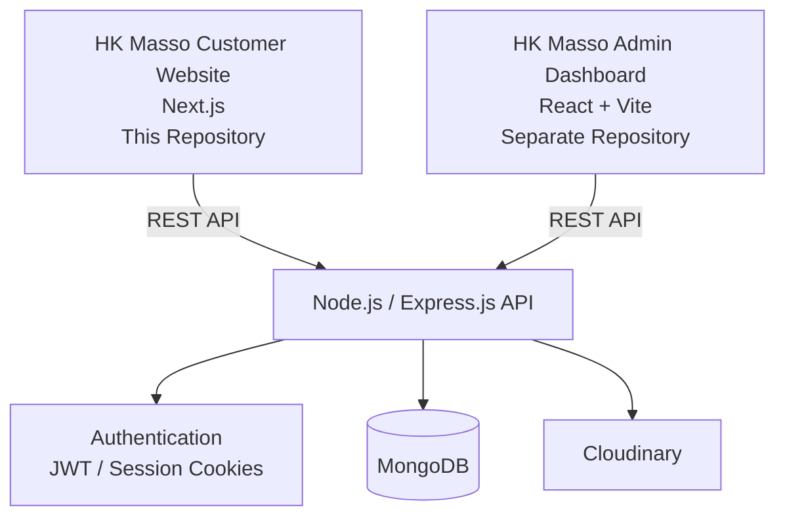

# HK Masso (Frontend)

A modern, responsive multi-language web application built for customers to explore services, book massage therapy sessions, manage appointments, and leave reviews.

🌐 **Live Demo:** [hk-masso-website.vercel.app](https://hk-masso-website.vercel.app)

---

## 🏗️ Architecture

The HK Masso platform is divided into separate applications that communicate through a centralized REST API.

* **Customer Website** — This repository. Provides the customer-facing experience for browsing services, booking appointments, and managing accounts.
* **Admin Dashboard** — Separate React/Vite application used by staff to manage services, bookings, users, and worker availability.
* **Backend API** — Separate Node.js / Express.js REST API responsible for authentication, business logic, and database operations.



Both frontend applications communicate with the backend through REST API endpoints. The frontends do not directly access the MongoDB database.

---

## 🚀 Features

### 🔐 Authentication & User Management

* Google OAuth Sign-In via Auth.js (NextAuth)
* Customer account management
* Profile updates
* Secure logout
* Account deletion

### 📅 Booking System

* Explore available massage services
* Select available dates and times using interactive date pickers
* View current and past bookings
* Manage existing appointments
* Real-time availability and booking data

### ⭐ Reviews & Feedback

* Submit reviews for completed sessions
* View customer feedback and reviews

### 🌍 Localization & Theming

* **Trilingual Support:** Full internationalization in Arabic, French, and English
* **Theme Switcher:** Light and Dark mode
* Responsive design across desktop, tablet, and mobile devices

### 📄 Static & Informational Pages

* About Us page
* Contact page
* Service information
* Customer-oriented navigation and content

---

## 📸 Website Preview

### Home Page


### Services


### Booking


### Customer Dashboard


---

## 🎥 Feature Demos

### Booking a Massage Session


### Language Switching


### Dark Mode


---

## 🛠️ Tech Stack

* **Framework:** [Next.js](https://nextjs.org/)
* **Authentication:** [Auth.js / NextAuth](https://next-auth.js.org/)
* **Styling & UI:** [Tailwind CSS](https://tailwindcss.com/), `tailwindcss-animate`, [Lucide React](https://lucide.dev/), `react-icons`
* **State Management & Data Fetching:** [Redux Toolkit](https://redux-toolkit.js.org/), [TanStack Query (React Query)](https://tanstack.com/query/latest), Context API, [Axios](https://axios-http.com/)
* **Internationalization:** `next-intl` / i18n
* **Utilities:** `date-fns`, `react-day-picker`, `use-debounce`

> **Note:** This repository houses the **Customer Frontend** application. Authentication integrations, business logic, database operations, and API endpoints are handled by separate backend services.

---

## 📂 Getting Started

### Prerequisites

Ensure you have [Node.js](https://nodejs.org/) installed on your machine.

### Installation

1. **Clone the repository:**

```bash
git clone https://github.com/hakimmahtout/HK-masso-website.git
cd HK-masso-website
```

2. **Install dependencies:**

```bash
npm install
```

3. **Start the development server:**

```bash
npm run dev
```

4. Open the local development URL provided by Next.js in your browser.

---

## 🔗 Related Repositories

| Project              | Description                                           |
| -------------------- | ----------------------------------------------------- |
| **Customer Website** | Customer-facing Next.js application — this repository |
| **Admin Dashboard**  | React/Vite role-based administrative dashboard        |
| **Backend API**      | Node.js / Express.js REST API powering the platform   |

---

## 📄 License

This project is part of the HK Masso platform.
